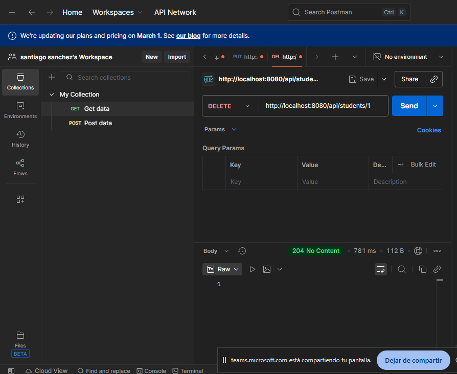

# Actividad: Configuración y Pruebas de Proyecto Spring Boot con Base de Datos en la Nube

**Nombre del Estudiante:** [Santiago Sanchez Rojas.]  
**Institución:** CESDE  
**Materia:** Backend 2  

---

## 1. Configuración de Base de Datos (Prisma.io)
Se ha configurado una instancia de PostgreSQL en la nube utilizando Prisma.io.

* **Enlace a la instancia:**
* **Captura de configuración:** 

---

## 2. Conexión y Ejecución del Proyecto
La aplicación Spring Boot se conecta exitosamente a la base de datos remota.

* **Log de la consola al iniciar:** 

---

## 3. Pruebas de la API RESTful (CRUD)
A continuación, se presentan las evidencias de las operaciones realizadas en la ruta base `/api/students` usando Postman.

### A. POST - Crear Estudiantes
Se crearon al menos 3 estudiantes diferentes.  

### B. GET ALL - Listar Estudiantes
Obtención de la lista completa de registros.  

### C. GET by Email
Búsqueda de un estudiante específico por su correo electrónico.  

### D. PUT - Actualizar Estudiante
Actualización de la información de un registro existente.  

### E. DELETE - Eliminar Estudiante
Eliminación de un registro de la base de datos.  

---

## 4. Ejecución de Pruebas Internas
Resultado de la ejecución del comando `mvn test`, demostrando que todas las pruebas unitarias e integración pasaron exitosamente.

---

## 5. Gestión de Credenciales
Se confirma que el archivo `.env` fue configurado localmente basándose en `.env.example` y que este **no** ha sido subido al repositorio de GitHub, cumpliendo con las normas de seguridad.
